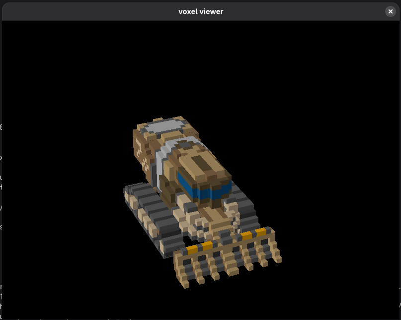
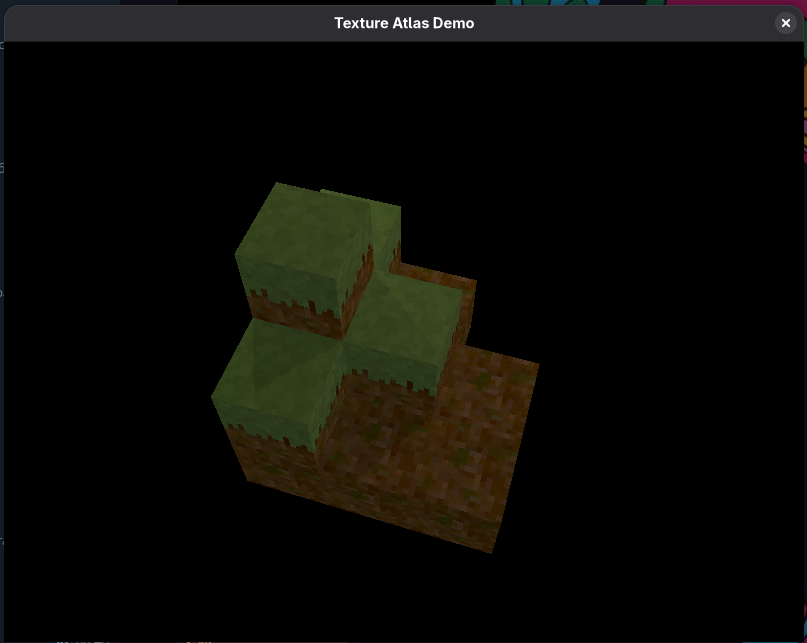
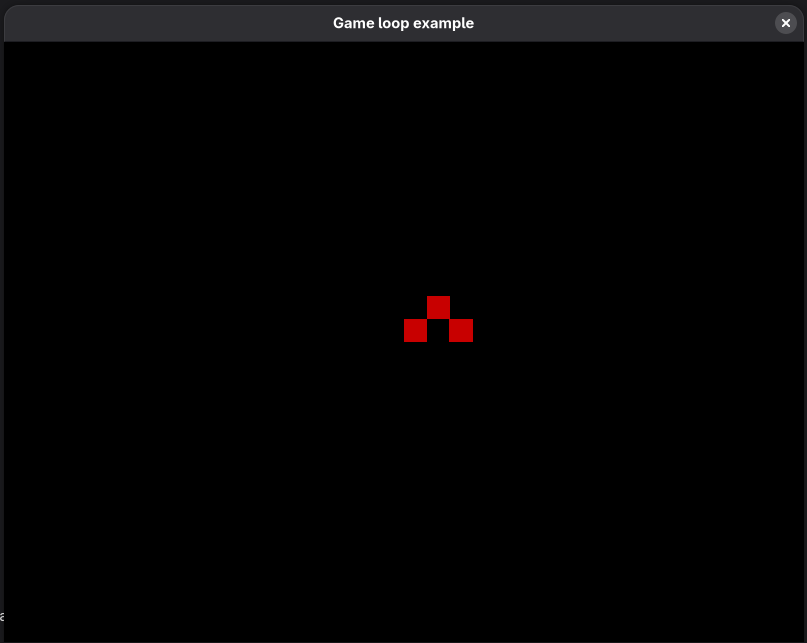

# voxel

A Haskell library for working with voxel grids, featuring:

* Data types to store voxels
* Generation of chunked meshes from grids
* Fast update of poly grids when voxel grid is modified
* GPU-accelerated rendering with GPipe
* Phong shading with shadow mapping
* Pixel-art post-processing with CIE Lab color quantization

## Building

This project requires [Nix](https://nixos.org/nix/) with flakes enabled.

### Using Nix (pure builds)

```bash
# Build the main viewer
nix build

# Build specific examples
nix build .#pixel-art-demo
nix build .#atlas-demo
nix build .#gameloop
nix build .#ui-example

# Run from corresponding directory (required for assets)
cd examples/pixel-art-demo && nix run ../..#pixel-art-demo
cd voxel-viewer && nix run ..#voxel-viewer
```

### Using Cabal (development)

```bash
# Enter development environment
nix develop

# Build everything
cabal build all
```

### Running with Optimizations

For better performance, build and run with optimizations:

```bash
cabal run -O2 pixel-art-demo
```

### Troubleshooting

If you get a segmentation fault on non-NixOS systems, use [nixGL](https://github.com/guibou/nixGL):

```bash
nixGL cabal run pixel-art-demo
```

## Examples

> **Note:** Examples must be run from their corresponding directories to find assets.

### Voxel Viewer

The main application for viewing MagicaVoxel (.vox) models with Phong shading and shadow mapping.

```bash
cd voxel-viewer
cabal run voxel-viewer
```



---

### Pixel Art Demo

Demonstrates the pixel-art post-processing pipeline with:
- Downsampling for chunky pixel aesthetics
- CIE Lab color quantization with up to 256-color palettes
- Ordered dithering (Bayer matrix) for better color distribution
- Dynamic shadow-casting point lights

```bash
cd examples/pixel-art-demo
cabal run -O2 pixel-art-demo
```

**Controls:**
| Key | Action |
|-----|--------|
| `0` | Disable palette (downsampling only) |
| `1-4` | Switch between palettes |
| `+` / `=` | Increase dither strength |
| `-` | Decrease dither strength |
| `Esc` | Exit |


---

### Atlas Demo

Showcases texture atlas rendering for voxels, demonstrating efficient batched rendering of multiple voxel models using a shared texture atlas.

```bash
cd examples/atlas-demo
cabal run atlas-demo
```



---

### Gameloop

A simple game loop example with player movement, demonstrating how to integrate voxel rendering with interactive gameplay.

```bash
cd examples/gameloop
cabal run gameloop
```

**Controls:**
| Key | Action |
|-----|--------|
| `W/A/S/D` | Move |
| `Esc` | Exit |



---

### UI Example (WIP)

> **Note:** This example is unfinished and may not work correctly.

Demonstrates the FRP-based UI widget system built on Reflex.

```bash
cd examples/ui
cabal run ui-example
```

## Architecture

The project is organized as a monorepo with multiple packages:

| Package | Description |
|---------|-------------|
| `voxel` | Core data structures for voxel grids |
| `voxel-render` | Shaders, cameras, scenes, post-processing |
| `voxel-app` | Reflex FRP integration with GPipe |
| `voxel-ui` | FRP-based UI widgets |
| `voxel-GPipe` | GPipe buffer format conversions |
| `voxel-MagicaVoxel` | MagicaVoxel model loading |
| `MagicaVoxel-vox` | .vox file format parser |
| `GPipe-GLFW` | GLFW context bindings for GPipe |

## License

MIT
